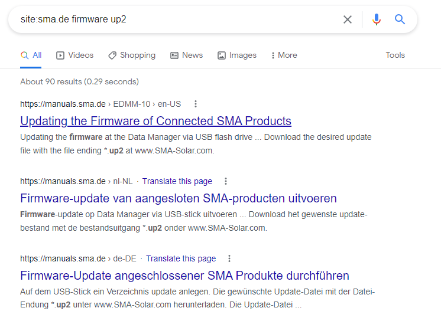

## Exercises

You will use your host computer or laptop to perform the Google and Shodan elements of this lab.

## Searching for Vulnerabilities using Google

1. Open the web browser on the desktop of your virtual machine (double click the icon).
2. Navigate to `https://www.google.com`
3. Perform searches for vulnerabilities in ICS equipment using the following search terms:

	* `SMA Solar Vulnerability`
    * `ICSA-19-281-01`
    * `CVE <DER Manufacturer>`
    * `Huawei Solar Vulnerability`
    * `Fronius Vulnerability`
    * `Tesla Powerwall Vulnerability`

**NOTE:** Most of the vulnerabilities identified through Google Searches will likely lead to the us-cert.cisa
advisory pages, which will provide additional details about the vulnerability and affected products.

Using the example above you will now use Google to identify Internet-connected devices. Identifying information presented by web servers can be used to search for Internet-connected devices.

1. Open a web browser (e.g., Internet Explorer, Firefox Web Browser, Chrome)

2. Navigate to [google.com](https://google.com)

    There are many other Google search options that can help narrow down the results to find an Internet-
    connected device. Below are a few additional search options:

    * `“inurl:<search string>”` – Use this option to search the URL for a specific word

		* This could be useful if the webpage is known to be located at a specific path on the web server

    * `“site:<search string>”` – Use this option to search for information on a specific domain

		* To limit the search to a particular domain (e.g., www.rockwellautomation.com), include

    * `“site:rockwellautomation.com”` in the search query

		* Add a minus sign (-) at the beginning (e.g., `–site:<search string>`) to exclude a domain from the search results

    * `“filetype:<file type>”` – Use this option to limit the search to a specific file type

		* This could be used to search for PLC configuration files that are being inadvertently hosted on a public web server

    * `“cache:<website>"` – displays google cache of the page. Useful for content that has been removed

3. Search Google for keywords by using the advanced search

	* `Huawei SUN2000 filetype:pdf`  
	* `intitle:fronius solar`
	* `intitle:"MODBUS TCP RS485 Converter" intext:"Module Name: MMTCPBCONV" "powered by
	  Atmel ARM."`   
	* Find software to interact with SunSpec-compliant devices: `site:github.com sunspec
	  modbus`    
	* Look for SMA firmware (\*.up2 files): `site:sma.de firmware up2`   

	Some additional search ideas are available from: [Exploit DB](https://www.exploit-db.com/google-hacking-database)   

	**NOTE:** Search results vary by time, so you may or may not find the same things.

	***
	
	***

	**CAUTION**: As with connecting to any unfamiliar sites on the Internet, be very careful
	connecting to any devices identified through Google. These could be live systems, they
	could be Honeypots used by researchers, or they could be a malicious attacker.

4. The Cybersecurity & Infrastructure Security Agency (CISA) has Industrial Control Systems Cyber Emergency Response Team (ICS-CERT) advisories located here: [ICS-CERT](https://www.cisa.gov/uscert/ics/advisories)

	There is also a vulnerability visualization dashboard here: [Vulnerability Visualization Dash](https://datastudio.google.com/u/0/reporting/f0d99ae7-c75b-4fdd-9951-8ecada5aee5e/page/p_khybw5e6rc?mc_cid=2ba4cff293&mc_eid=UNIQID)

	Can you identify any Solar manufacturers in the list?

5. Try using some of these techniques to search your company domain to identify any Internet-connected devices attached to your network, or to see if any private information is being leaked.
