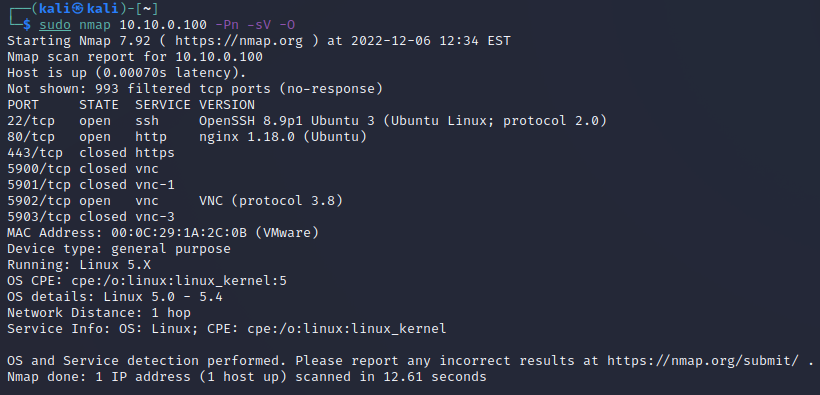

## Exercises

### Reconnaissance with Nmap

1. In the Kali VM, open a terminal window by clicking on the black `$_` icon on the bar at the top.

2. Enter the following command in the terminal to execute the Nmap scan:

	`sudo nmap 10.10.0.100 -Pn -sV -O`

	Enter the kali password `kali` and press enter.

	Nmap identifies several open ports on the DER. The optional flags have the following meanings:

	   * `-Pn`: Treat all hosts as online -- skip host discovery
	   * `-sV`: Probe open ports to determine service/version info
	   * `-O`: Enable OS detection

3. Review this list of common TCP ports that may exist on DER equipment and compare that to the results that you got from the nmap scan. 

	```
	   20, 21   	- File Transfer Protocol (FTP)
	   22       	- Secure Shell (SSH)
	   23       	- Telnet
	   25       	- Simple Mail Transfer Protocol (SMTP)
	   53       	- Domain Name Server (DNS)
	   67, 68   	- Dynamic Host Configuration Protocol (DHCP)
	   80       	- HyperText Transfer Protocol (HTTP)
	   110      	- Post Office Protocol (POP3)
	   161, 162 	- Simple Network Management Protocol (SNMP)
	   389      	- Lightweight Directory Access Protocol
	   443      	- HTTP with Secure Sockets Layer (SSL)
	   502      	- Modbus
	   3389     	- Remote Desktop Protocol
	   5900-5903    - Virtual Network Computing
	```
	
	

4. In the case of the DER simulator, we can see there is an open SSH port, HTTP website, and VNC server.  We can also see that this device is running a Linux kernal, which would be helpful information for an adversary as they will be able to look up vulnerabilities for that operating system. 

**CAUTION:** *Generally, it is not a recommended practice to perform port scanning 
in a production environment due to the high likelihood of disrupting operations.*
