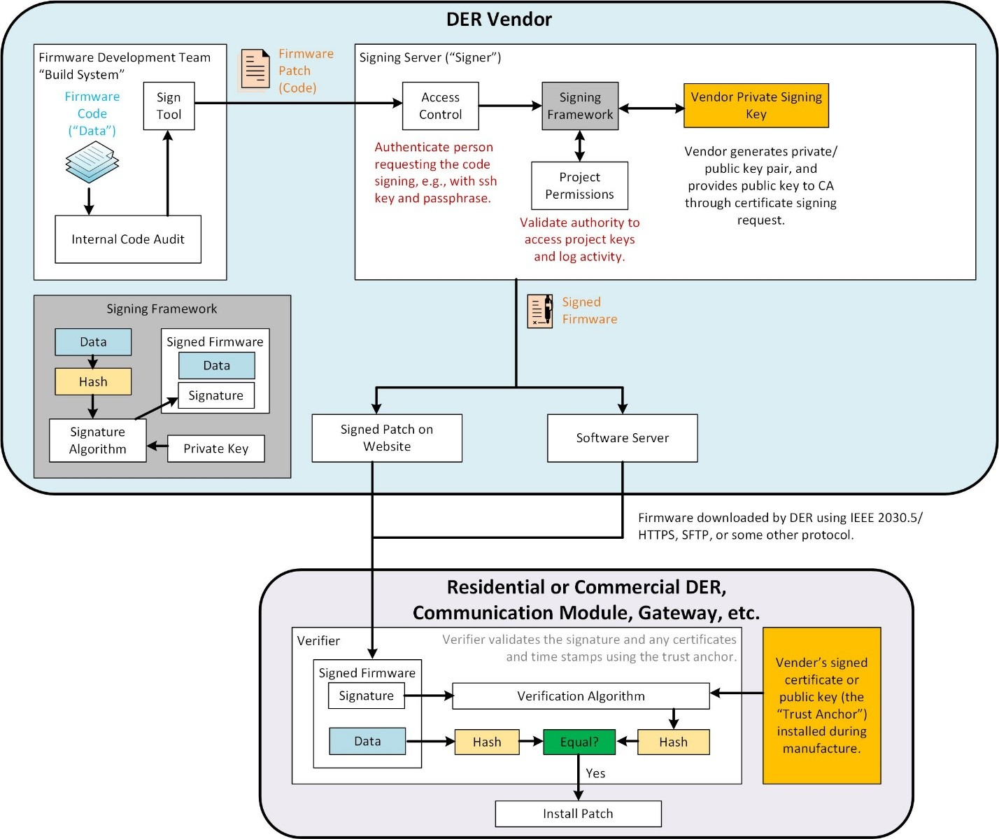

# Encryption, Code Signing, and Firmware

**Scenario:** You are a DER manufacturer who needs to update the firmware on your fielded devices because a new vulnerability was discovered. In order to do this securely, we would like to use **encryption** and **digital signatures**.

Code signing is a process for ensuring authenticity and integrity of data using digital signatures. Code signing uses a digital signature mechanism to verify the identity of the data source and a checksum/hash to verify the data has not been altered in transit. There are three primary actors in a code signing architecture:   

* The developer of the code or data who submits the code to the signer.
* The signer entity that is responsible for managing the signing keys. The signer securely  generates the private/public key pair and then, either:
    * provides the public key to a certification authority (CA) through a certificate signing request (CSR) to tie their identity to the public key, or
    * shares the public key using a trusted, out-of-band mechanism.
The signer has access control mechanisms or other tools to confirm the identity and authorization of the code/data developer.
* The verifier that is responsible for validating the signed code signature.

The developer creates the code and confirms it is free of errors with an auditing mechanism. This is then sent to the signing tool which requires the developer authenticate themselves to the signer. Once authenticated, the signing framework confirms the developer has permissions to sign this type of project and then signs the data using the private key of the signer (the software vendor in the figure).   

The signer’s public key is then installed in each of the products to verify the authenticity of the signed firmware data. The signing process first hashes the data and then runs this hash through a signature algorithm (such as RSA asymmetric encryption) to create the signature that is packaged with the data to create the signed data/firmware.   

Once the data reaches the DER for installation, the signature algorithm uses the public key of the manufacturer, pre-installed on the device, to verify the validity of the data. To do this, it generates the hash of the data and compares that to the decrypted signature. If they match, the authenticity of the data is confirmed.

# Lab Tools
* **strings** - In this lab, we will use strings to look at firmware images to identify different types of firmware.
* **OpenSSL** - In this lab, we will use OpenSSL to demonstrate asymmetric encryption and digital certificate concepts.

# Goal

The goal of this lab is to demonstrate asymmetrical encryption and code signing/digital signatures.

# Prerequisites

* Kali VM
    * strings
    * OpenSSL
* DER VM
	* Web server running