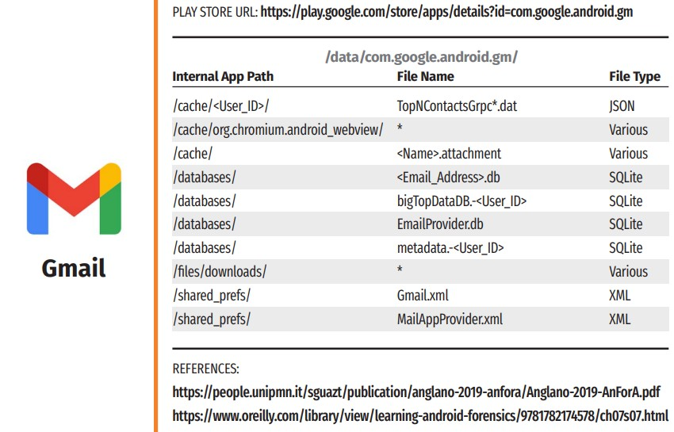

# Vulnerable Application Programming Interfaces (APIs) and Smart Phone App Analysis

## Part A - APIs
In this lab, you will have the opportunity to familiarize yourselves with a simulated DER vendor's RESTful (Representational State Transfer) API (Application Programming Interface). The lab will provide a hands-on experience where you and learn about the various features and functionalities of the API, while also being able to practice interacting with the API, making HTTP (Hypertext Transfer Protocol) requests, and receiving responses from the DERMS Server. Authentication using JWT (JSON Web Tokens) will be also included to demonstrate how to secure the DER API. Additionally, the lab will cover testing potential vulnerabilities of the API using OWASP (Open Web Application Security Project) ZAP (Zed Attack Proxy). 

#### API
An API is a set of protocols, routines, and tools for building software applications. It defines how different software components should interact with each other, providing a standard interface for communication. In simpler terms, an API allows different software systems to talk to each other and exchange information or functionality without requiring the developer or the end-user to know the underlying details of how the other system works. APIs can be very useful in a DER ecosystem as a “Middleware”, where a PV Inverter owner may want to login or where a Solar Company administrator may need to retrieve customer information from the DERMS server, for example. 

#### RESTful API
Representational State Transfer APIs are a type of web API that follow a set of architectural principles and constraints that make them simple, lightweight, and scalable. RESTful APIs are based on the HTTP (Hypertext Transfer Protocol) standard, which is the protocol used for transmitting over the web. They operate on resources, which can be any type of data or object that can be represented in a digital format. Each resource is identified by a unique URL (Uniform Resource Locator), and clients can use HTTP methods such as GET, POST, PUT, and DELETE to interact with those resources.

* GET: Reading/Retrieving data from the server
* PUT: Update existing resources with new data in the server
* POST: Submit new data to a server
* DELETE: Delete an existing resource from the server

One of the key principles of RESTful APIs is that they are stateless, meaning that each request contains all of the information necessary for the server to respond to it. This allows RESTful APIs to be easily scalable and distributed, as they do not rely on server-side sessions or stateful mechanisms.

## Part B - Smart Phone Apps
Many distributed energy resources are now accessed and updated from smart phone applications. These apps link the manufacturer to the fielded equipment. Android apps are installed from the Google Play Store, other App stores, or via the ADB or SD Card. Apps are organized based on categories (e.g., Communications, Social Networking, Business/ Productivity, and so on). Once an app is installed on an Android device:

* App APK is stored in the `USERDATA` partition in a subfolder of the `/app` folder
* App Data is stored in the `USERDATA` partition in a subfolder of the `/data` folder (app Sandbox)

The App Data folder uses the package name (e.g., `com.whatsapp`, `com.facebook.katana`, or `org.telegram.messenger`). Once installed, an app can request permissions to read and write data in the `/media` folder in the USERDATA partition. An example of Gmail paths from the “Android Third-Party Apps Forensics Reference Guide” ©2021 Mattia Epifani.

   

Why this matters is that mobile apps can include hard-coded secrets like administrator passwords, cryptographic keys, account credentials, or internet-connected API endpoints. Finding this secret information would allow an attacker to compromise the DER or EV Charger.

On Android phones, Android App (APK) software contrains the application. iOS apps are run on Apple phones. We can download and inspect these app files as will be shown in this lab. 

## Goal 
The goal of this lab is to demonstrate the core architecture of a web application and more specifically focus on the RESTful API aspect of it. By the end of it, students will have a good understanding of how to interact with an API through Postman, i.e., perform JWT authentication and make HTTP requests. Additionally, students will have gained valuable knowledge in how to perform security testing of the APIs using industry-standard tools such as OWASP ZAP.   

The lab shows the type of information at is contained in smart phone applications and why this could matter from an OSINT perspective.  The lab demonstrates the need to secure these apps. 

**NOTE**: This lab uses actual vendor APK files.  If you do discover a vulnerability, please report this using responsible disclosure policies. 

## Prerequisites

* DERMS Windows VM:  
	* python3
	* pip3
	* flask (python library)
	* flask_cors (python library)
	* Pyjwt (python library)
	* requests (python library)
	* Node.js (node v18.14.0)
	* npm (npm v9.3.1)
	* express (npm module)

* Kali Linux VM:
	* PostMan
	* OWASP ZAP
	* Firmware files  
	* JADX, an open-source Dex to Java decompiler  
	
#### Tools

**Postman** - In this lab we will simulate the DER owner (i.e., the client) that will interact with the DER vendor's API using Postman. It provides an easy-to-use interface for sending HTTP requests to an API and inspecting the server’s response. We can create requests and specify parameters, headers, authentication, and other settings to test different scenarios and ensure that the DER Flask API works as expected. 

[PostMan](https://www.postman.com/)

**OWASP ZAP** - OWASP ZAP is a free and open-source security testing tool used for finding vulnerabilities in web applications. It will be utilized in this lab to identify security vulnerabilities of the DER Vendor's API, such as injection flaws, cross-site scripting (XSS), broken authentication and session management, and other vulnerabilities. It supports a variety of security testing techniques, including passive scanning, active scanning, and fuzz testing, and can be integrated into the software development lifecycle (SDLC) to enable penetration testing as part of the development process. 

[OWASP ZAP](https://owasp.org/www-project-zap/)