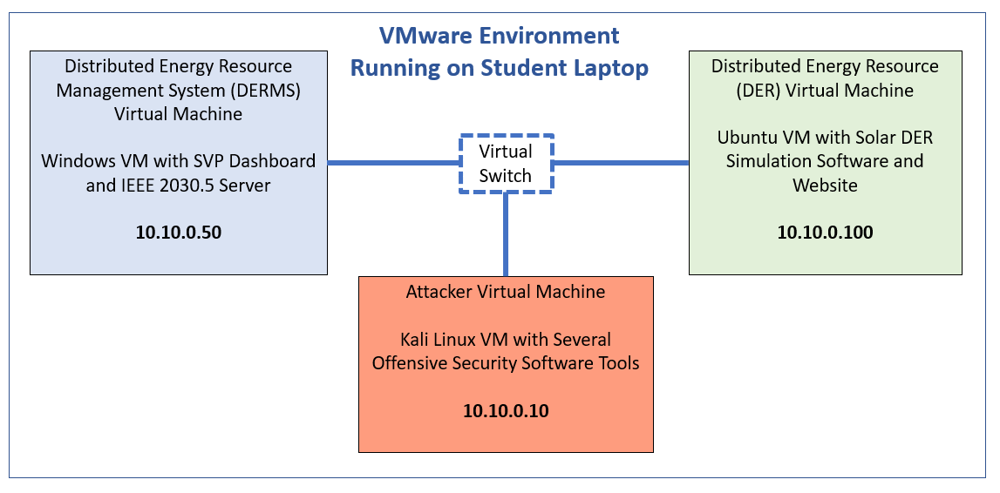

# Overview of Equipment and Learning Objectives

## Lab Equipment for Virtual Machine Training
* DER Simulator running on Virtual Machine
* DERMS Windows Virtual Machine
* Kali Linux Virtual Machine



## Lab Equipment for Training with Hardware
* DER Simulator running on Raspberry Pi
* DERMS Windows Virtual Machine
* Kali Linux Virtual Machine
* Switch – Red Lion SLX5MS-1 5-Port Managed Sixnet Series


## Network Topology

It is important to note the IPs for each of the machines in the lessons. 

    Windows DERMS VM: 10.10.0.50
	
	Hacker Kali VM:	10.10.0.10
	
	DER Simulator: 10.10.0.100

## Lab Requirements

1. Windows DERMS Machine
    * __Username: Admin, Password: admin__
    * Firefox Web Browser
	* Wireshark
	* SVP Dashboard
	* IEEE 2030.5 Server

2. Kali VM for Hacking
    * __Username: kali, Password: kali__
    * Firefox Web Browser
    * Ettercap
    * Binwalk
    * Nmap
    * Python 3.6

## Disclaimer

Personnel involved in the design, development, implementation and evaluation of this  training comply with the laws, regulations, contractual obligations, policies, and professional standards governing all Idaho National Laboratory (INL) business.

Training personnel do not discriminate on the basis of race, color, religion, national origin, sexual orientation, physical or mental disability, or gender expression/identity. Additionally, they do not possess proprietary interest in any product, instrument, device, service, or material discussed in this course.

## Continuing Education Units (CEUs)

The Infrastructure Assurance and Analysis (IAA) Training Department within the National & Homeland Security (N&HS) directorate at INL is accredited by the International Association for Continuing Education and Training (IACET) and is accredited to issue IACET Continuing Education Units (CEUs). IAA is authorized by IACET to offer **0.8** CEUs for this training. This number is based on **7.5** student engaged contact hours.

**NOTE:** A learner may miss no more than 15% of the course time and still qualify for completion and CEU credits. At the conclusion of this course, you will receive a certificate of completion that can be used to provide evidence of completion of continuing education requirements.

```
          Lost or misplaced completion certificates can be obtained from:
                      Infrastructure Assurance and Analysis
                               nhs-training@inl.gov

Include the following information:

  • Completion date of training              • Preferred method of delivery (email or mail).
  • Course title                               If mail, provide complete address information.
  • Name (first and last) of the requestor
```

## Learning Objectives

1. Describe the logical DER interfaces
2. Reconstruct a cyber event using the Cyber Kill Chain
3. Discuss guidance and mitigation concepts
4. Describe the importance of attack prevention.

## Applicable NIST NICE Framework KSAs

Knowledge ID: K0144, K0177, K0362, K0170, K0408, K0234, K0436   
Tasks ID: T0298, T0620, T0282   
Skills ID: S0295, S0370, 0121   
Abilities ID: A0170   

## Evaluation

Cumulative completion of the labs outlined below, in combination with general 
observation and questioning from instructors to check for understanding, will 
provide an avenue to determine a trainee’s successful completion of this training.


